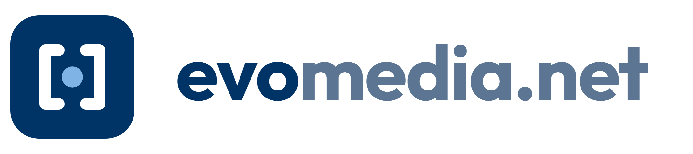

<picture>
  <source media="(prefers-color-scheme: dark)" srcset="evomedia-logo-horizontal-reversed.png">
  
</picture>

Software built and operated by Kelly Michels — multi-tenant web apps, the
platform they share, and the tooling that runs them.

| | |
|---|---|
| **[evomedia.net](https://evomedia.net)** | products, projects, and background |
| **[docs.evomedia.net](https://docs.evomedia.net)** | product documentation |

### Public repositories

| Repository | What it is |
|---|---|
| [evo.platform](https://github.com/evomedia-net/evo.platform) | Multi-tenant SaaS foundation — tenancy, auth, RBAC, billing, audit logging — with Node and Python SDKs, a Next.js template and a scaffold CLI |
| [evo.videostroll](https://github.com/evomedia-net/evo.videostroll) | Agent-driven narrated walkthrough videos of websites — MCP server and Claude Code skill |
| [evo.locate](https://github.com/evomedia-net/evo.locate) | Self-hosted IP geolocation API — no account, no API key, no per-query cost |
| [evo.zscripts](https://github.com/evomedia-net/evo.zscripts) | Short, one-word commands for multi-project development |
| [evo.snippets](https://github.com/evomedia-net/evo.snippets) | Small, self-contained tools that solve one problem well and run anywhere |

Contact: [dev@evomedia.net](mailto:dev@evomedia.net)
